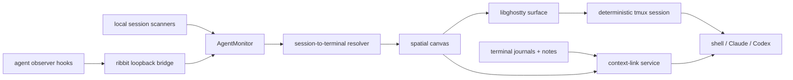

# ribbit spatial canvas plan

## outcome

ribbit becomes one native macOS workspace with five connected capabilities:

- conventional full-size terminal and note tabs
- a spatial project canvas
- persistent tmux-backed terminals
- live agent state on every terminal node
- explicit context links between nodes

The existing noot repository becomes ribbit's internal agent-monitoring engine.
Its session parsing, observer hooks, local bridge, notifications, and focus
routing are folded into ribbit. The separate noot overlay and application UI
are not embedded.

## implementation status — 2026-07-23

Completed and verified:

- libghostty shortcut ownership checks `ghostty_surface_key_is_binding`
  before ribbit handles a command shortcut
- Shift+Return and Option+Return use the live `RibbitGhosttyView` event path,
  write their exact bytes directly to the active libghostty surface, and
  suppress duplicate key-up delivery
- translation modifiers, left/right modifier state, and command-key release
  forwarding are connected to libghostty
- automatic tmux discovery, direct-shell fallback, deterministic session
  naming, create/attach, inspection, and explicit termination are implemented
- packaged and development terminals export the bundled `xterm-ghostty`
  terminfo database to tmux clients
- versioned workspace files persist stable terminal IDs, tabs, notes,
  selection, mode, canvas frames, camera, names, colors, and directories
- `NSTextInputClient` marked-text/preedit handling now routes normal, composed,
  and dead-key input through AppKit before libghostty
- Settings reports tmux version/path or direct-shell fallback, with install
  command copying and recheck; restored missing sessions show a visible
  recovery banner
- the user-owned noot session engine is folded into ribbit as provider-neutral
  Codex, Claude, and Cursor models, JSONL scanners, state parsing, a
  loopback-only bridge, exact terminal resolution, and optional observer hooks
- live agent badges appear on the exact terminal in the project rail, tab
  strip, and canvas; completed events remove the badge
- terminal surfaces can move between tab and canvas hosts without a stale
  SwiftUI host unmounting or blanking the reparented libghostty view
- directed, same-project context edges persist in workspace schema version 2;
  targets can list and read linked notes or cleaned terminal journals through
  `ribbit context` without prompt injection
- Ribbit's documented app shortcuts now remain app-owned even when Ghostty has
  a conflicting default binding, while unreserved and user-defined Ghostty
  bindings remain terminal-owned

Evidence:

- 68 Swift tests pass, including real `NSEvent` view dispatch, exact
  modified-Return bytes, a Command shortcut ownership matrix, and an isolated
  tmux create/inspect/terminate lifecycle, provider parsing, exact terminal
  assignment, badge clearing, safe libghostty reparenting, workspace migration,
  non-overlapping canvas layout, context access isolation, explicit titlebar
  hit-testing, and first-click Ghostty activation
- provider resume commands are shell-quoted and explicit, recovery metadata
  survives workspace migration, Noot state imports once without deleting the
  original, and ready/attention transition detection is regression-tested
- the installed Codex 0.145.0 and Claude Code 2.1.215 CLIs confirm
  `codex resume <session-id>` and `claude --resume <session-id>`; Cursor
  3.12.17 is detected for focus routing but has no equivalent agent-session
  resume command
- the checked release gate sends 21 editing/navigation chords and 51 bytes
  through both a direct PTY and an isolated attached tmux client; both preserve
  the complete stream, with tmux's documented Home/End normalization accepted
- unmatched live sessions now appear in an external-agent dock and can be
  clicked, pinned, or dragged onto the current canvas; pin metadata and canvas
  position persist in workspace schema version 4
- libghostty clipboard callbacks now cross to the main actor without Swift 6
  isolation warnings, and AppKit mouse buttons 0–10 map distinctly to
  Ghostty left/right/middle/extended buttons
- conventional commands now close only the selected tab, cycle or directly
  select tabs, clear the terminal, and adjust/reset terminal text size; every
  chord is included in the single-owner shortcut matrix
- related terminal, note, and external-agent nodes can be grouped inside a
  persistent labeled canvas boundary using workspace schema version 5
- the signed production app and bundled license verifier pass
- a live packaged terminal detached and reattached to the same
  `ribbit-base-<terminal-id>` tmux session without changing its creation time
  or creating a duplicate
- a live packaged zsh/tmux rehearsal passed Left, Backspace, ordinary Return,
  and Shift+Return multiline entry without dropped or duplicate input
- the signed app accepted a loopback Codex lifecycle event, tagged only its
  UUID-matched terminal in both tab and canvas modes, rendered the terminal
  after mode switching, and accepted a command from inside the canvas node
- a live directed note-to-terminal edge survived relaunch; the target terminal
  listed the note by UUID/title and `ribbit context read untitled.txt` returned
  `context edge live proof`

Still open in phase 2:

- run the hands-on Codex and Claude editing matrix in the packaged app
- verify a non-US hardware keyboard layout and live CJK input source

Still open in phases 3–4:

- live Codex, Claude, and Cursor hook rehearsals after explicit hook migration
- live notification-click focus and post-reboot Codex/Claude resume rehearsal

## workspace modes

ribbit is not a canvas-only terminal. Every project has two equal views over
the same underlying terminals and notes:

- **tabs** — conventional full-size terminal and text-editor tabs
- **canvas** — draggable and resizable spatial views of those same tabs

Tab mode is the default for a new workspace. Each project remembers its last
selected mode. Switching modes changes only presentation: it does not create,
copy, restart, detach, or terminate a terminal. A terminal's UUID, tmux
session, scrollback, working directory, journal, title, color, and agent state
remain identical in both modes.

## terminal architecture

ribbit uses libghostty and tmux together:

```text
ribbit canvas
    → libghostty rendering and input
        → tmux session
            → shell / Claude / Codex
```

libghostty remains responsible for native Metal rendering, keyboard input,
selection, clipboard handling, and terminal behavior. tmux owns the shell and
long-running process independently of the libghostty surface.

Each canvas terminal has a stable UUID and a deterministic tmux session name:

```text
ribbit-<project-key>-<terminal-id>
```

When a terminal view appears, libghostty launches or attaches to that tmux
session. Destroying the view, quitting ribbit, or a ribbit crash detaches the
client without terminating the tmux-owned shell. Relaunching ribbit restores
the canvas document and reattaches every visible node to its session.

Closing a view, hiding a node, and terminating a session are separate actions.
Only an explicit terminate action runs `tmux kill-session`.

### direct-shell fallback

tmux is detected at runtime and is never installed silently. If it is missing,
ribbit uses the current direct libghostty shell backend and clearly states that
the process will stop when ribbit quits.

Settings shows one of:

```text
tmux available — persistence active
tmux unavailable — terminals stop when ribbit quits
```

The unavailable state includes:

- the installation command `brew install tmux`
- a copy button
- a `recheck` button
- no automatic Homebrew invocation

tmux is installed at `/opt/homebrew/bin/tmux` on the development Mac (version
3.7b). An isolated create, detach, inspect, and kill smoke test has passed.
ribbit must still discover tmux at runtime rather than assuming a Homebrew
installation path.

### reboot behavior

A Mac reboot ends the tmux server. ribbit still restores the project graph,
terminal metadata, working directories, names, colors, context links, and saved
provider session IDs. Missing tmux sessions reopen as recoverable nodes with
provider-specific resume actions, such as resuming a known Codex or Claude
session. ribbit offers the action instead of automatically executing it.

## libghostty input parity

The current embedded libghostty surface already supports key press, repeat, and
release events; Control, Option, Command, Shift, and function keys; clipboard
copy and paste; terminal search; scrolling; mouse selection; and file/image
drops.

Before the terminal layer is considered release-ready, it must also:

- implement `NSTextInputClient` composition for dead keys, accented input,
  Japanese, Chinese, Korean, and dictation
- use `ghostty_surface_key_translation_mods` and forward `flagsChanged` events
  so Option/Alt and enhanced keyboard protocols behave correctly
- arbitrate app shortcuts with `ghostty_surface_key_is_binding` so ribbit menu
  commands and terminal/TUI keybinds do not swallow each other
- connect Shift+Return and Option+Return compatibility fallback bytes directly
  to the active libghostty surface and test them in Claude and Codex
- complete middle/extra mouse-button reporting and add conventional terminal
  shortcuts for tab cycling, close, font zoom, and scrollback clearing

The implementation should port the relevant behavior from Ghostty's native
AppKit surface instead of inventing a second keyboard model.

### shortcut ownership contract

Shortcut arbitration is a correctness boundary, not a convenience feature.
Every key event follows one deterministic ownership path:

1. macOS keeps only truly global application commands such as Quit and the
   explicit Ribbit shortcuts that are valid while a terminal is focused.
2. Ribbit asks `ghostty_surface_key_is_binding` whether libghostty owns the
   chord before executing a menu key equivalent.
3. If libghostty owns it, Ribbit forwards the original press, repeat, and
   release events exactly once and does not also run an app command.
4. If Ribbit owns it, Ribbit performs the app command exactly once and does not
   leak the chord into the terminal.
5. Everything unclaimed is sent to the terminal unchanged, including Tab,
   Shift-Tab, arrows, Option-arrows, Escape, and control chords used by Codex,
   Claude, shells, editors, and multiplexers.

`performKeyEquivalent`, `keyDown`, `keyUp`, and `flagsChanged` must share this
single decision path. They may not independently guess ownership. Focused
search or note fields remain normal AppKit text inputs and do not route their
editing keys into the terminal.

The arbitration suite must cover conflicts involving Command-C/V/F/W/T,
Command-1 through Command-9, tab cycling, font sizing, canvas commands, tmux
prefix sequences, provider TUI bindings, and user-configured Ghostty bindings.
Each case asserts both sides: the expected owner fires once and the other owner
does not fire.

### modified Return contract

The fallback is connected to `RibbitGhosttyView`'s live event path. View-level
tests inject real `NSEvent` values and capture the exact bytes at the libghostty
surface transport boundary. Remaining Phase 2 work must:

1. Determine whether libghostty's enhanced keyboard protocol will encode the
   active Return chord.
2. Prefer libghostty's native encoding whenever it is available.
3. Use the tested Shift+Return or Option+Return fallback only when enhanced
   encoding is unavailable.
4. Keep writing the fallback bytes to the active surface exactly once and
   consuming the originating AppKit event so a second Return is never sent.
5. Preserve normal Return, keypad Enter, key repeat, key release, and all other
   modifier combinations without applying the fallback.

Automated tests must inject real `NSEvent` key events through the view-level
dispatcher—not call the helper directly—and capture the resulting terminal
bytes. End-to-end checks then run Shift+Return and Option+Return in a shell,
Codex, and Claude in both direct-shell and tmux modes. The expected outcome is
defined per active program: newline versus submission must match that program
in standalone Ghostty.

## testing contract

Testing is part of every feature and phase. A phase is not complete until its
automated checks pass and the real developer workflow has been rehearsed in
the built app. Dropped keys, wrong escape sequences, stuck modifiers,
duplicate characters, or a cursor that disagrees with the underlying process
are release blockers.

### test layers

1. **model tests:** workspace persistence, project isolation, node geometry,
   names, colors, agent state, context links, and recovery metadata.
2. **terminal byte harness:** a small PTY fixture records the exact bytes and
   CSI sequences received for each chord. The same cases run through
   direct-shell and tmux-backed sessions.
3. **integration tests:** create, detach, reattach, rename, resize, terminate,
   and reconstruct isolated tmux sessions without touching the user's normal
   tmux server.
4. **UI interaction tests:** focus, clicking, dragging, resizing, tab/canvas
   switching, project switching, file drops, menus, search, and accessibility
   keyboard navigation.
5. **workflow rehearsals:** launch real Codex and Claude sessions, make
   realistic typing mistakes, correct them in place, switch around the
   workspace, quit ribbit, and verify everything returns correctly.

### terminal editing matrix

Tests must edit inside a partially written prompt. Merely observing a key-down
event is not enough.

| action | shell/readline or zsh | Codex and Claude TUIs | required result |
| --- | --- | --- | --- |
| type and repeat | letters, numbers, punctuation, held keys | ordinary and multiline prompts | no missing, duplicated, or reordered input |
| move by character | Left/Right | Left/Right within a prompt | cursor and edit position remain aligned |
| move by word | Option-Left/Right | provider-supported word navigation | correct sequence passes through tmux unchanged |
| line boundaries | Control-A/E and Command-Left/Right where supported | provider-supported equivalents | expected movement without changing app focus |
| vertical movement | history and multiline input | history, menus, and multiline input | ribbit does not steal Up/Down |
| completion and focus | Tab and Shift-Tab | completion, suggestion, or TUI focus | focus never escapes into ribbit chrome accidentally |
| correction | Backspace and Fn-Delete at start, middle, and end | same | exactly one intended character is removed |
| submission | Return and Shift/Option/Control-Return | send or newline according to the TUI | key and fallback behavior are deterministic |
| control | Escape, Control-C/D/Z/L | cancel, interrupt, EOF, suspend, clear | behavior matches Terminal and Ghostty |
| navigation | Home, End, Page Up/Down | scrollback and TUI navigation | no canvas or tab shortcut conflict |
| composition | paste, multiline paste, Unicode, emoji, dead keys, and IME | prompt entry | text is preserved without corruption |

Run this matrix with key repeat, rapid corrections, a non-US keyboard-layout
smoke test, and after moving focus between terminal nodes. Repeat at multiple
terminal sizes because resizing can reveal cursor-position and line-wrap
defects.

### representative developer rehearsal

1. Create a project and open three Codex terminals, two Claude terminals, one
   ordinary shell, and one Cursor-linked session.
2. In every terminal, type an intentionally imperfect multiline prompt; move
   through it with arrows and Option-arrows, insert text in the middle, use
   Backspace and Forward Delete, use Tab/Shift-Tab, paste a file path, and
   submit it.
3. Start concurrent work, switch between tabs and canvas, resize nodes and the
   app, switch projects, hide the project, and return. Every session must keep
   its own focus, dimensions, scrollback, working directory, name, color, and
   process.
4. Exercise agent transitions through running, needs-you, ready, and exited;
   focus a terminal from its badge; add a context link and verify the receiving
   agent can read the expected snapshot.
5. Quit and relaunch ribbit while work is running, reattach the exact tmux
   sessions, and repeat input editing. Then stop an isolated tmux server to
   test workspace reconstruction and provider-session resume offers.

This rehearsal becomes a checked release script and runs before every
downloadable build until enough of it is reliably automated.

## workspace graph

Each project has one versioned workspace document:

```text
~/Library/Application Support/ribbit/workspaces/<workspace-id>.json
```

The document stores:

- camera pan and zoom
- node identity, type, frame, ordering, collapsed state, and group membership
- terminal launch configuration and deterministic tmux session name
- note file references
- directed context links
- pinned external-agent references
- selected node and workspace mode

Runtime agent activity remains separate because it is ephemeral. Stable
terminal and provider session IDs connect runtime state to saved nodes.

## agent monitoring

Every ribbit terminal receives:

```text
RIBBIT_TERMINAL_ID
RIBBIT_PROJECT_ID
RIBBIT_PROJECT_ROOT
RIBBIT_BRIDGE_URL
```

The renamed noot observer hooks forward these fields with the provider session
ID. ribbit resolves an agent to a terminal by terminal ID first, then TTY and
project root as fallbacks.

A terminal node shows one restrained live state:

- running: animated mint activity mark
- needs you: red badge with permission, question, or plan detail
- ready: static mint dot
- stale or disconnected: no badge

Agent sessions started outside ribbit appear in a compact agent dock. Clicking
one focuses its original Codex task, Terminal or iTerm session, Cursor window,
or browser tab. Dragging one onto the canvas pins it as an external agent node.

## explicit context links

A context link is a directed, user-created edge from one node to another. It is
functional rather than decorative.

```text
source terminal or note
    → read-only context edge
        → target terminal
```

For the first implementation:

- note sources expose their current saved text
- terminal sources expose their continuously journaled transcript
- the target receives read-only, on-demand access through a local
  `ribbit context` command
- no transcript is silently injected into an agent prompt
- link access is limited to nodes in the same project

The graph persists an edge as a stable source node ID, target node ID, and
context type. `ribbit context list` shows available sources inside the target
terminal. `ribbit context read <node-id>` returns the current cleaned snapshot.
Removing the edge immediately removes access.

Later provider adapters may offer an explicit `send context` action, but only
when the target provider has a verified input path and the user confirms the
content.

## system flow



## delivery plan

### phase 1 — canvas persistence

Estimate: 1 focused day.

- Commit the current ribbit baseline.
- Add versioned `WorkspaceDocument`, `CanvasNode`, `CanvasEdge`,
  `CanvasCamera`, and `TerminalRecord` models.
- Persist documents with atomic writes and schema migration.
- Move the existing canvas frames and workspace mode into the document.
- Add model and UI tests for relaunch restoration, corrupt-file recovery,
  project isolation, view switching, resizing, focus, and terminal editing.

Done when relaunching ribbit restores the same nodes, positions, camera,
selection, and project separation, and steps 1–3 of the developer rehearsal
pass.

### phase 2 — tmux backend and terminal input parity

Estimate: 1.5–2 focused days.

- Add one terminal backend abstraction shared by tab and canvas modes.
- Implement deterministic create, attach, detach, inspect, and terminate
  operations for tmux.
- Keep direct libghostty shells as the explicit fallback.
- Add tmux detection, settings status, installation copy, and recheck.
- Complete the libghostty input-parity requirements and test independent nodes
  against isolated temporary tmux sessions.
- Run the complete terminal editing matrix through both direct-shell and tmux
  backends and compare their byte-harness output.
- Add event-path tests proving shortcut ownership and modified Return delivery
  from `NSEvent` through `RibbitGhosttyView` to captured terminal bytes.

Done when two canvas nodes own two independent tmux sessions and both reattach
with their processes and scrollback after ribbit quits and relaunches, while
both conventional shells and agent TUIs pass the keyboard compatibility suite
without backend-specific input differences. No shortcut may fire in both
Ribbit and the terminal, and Shift/Option+Return must produce exactly one
verified action in shell, Codex, and Claude.

### phase 3 — noot agent tracking

Estimate: 1–2 focused days.

- Port session models, parsing, transition detection, loopback bridge,
  notifications, hook management, and focus routing into
  `RibbitAgentCore`.
- Rename noot paths, messages, scripts, settings, and notification identifiers
  to lowercase ribbit equivalents.
- Import existing noot state once without requiring the noot app to run.
- Keep hook installation explicit and reviewable in settings.
- Port noot's parser, bridge, transition, dismissal, and routing tests.
- Test recorded, malformed, partial, and version-changed provider output before
  running live Codex, Claude, and Cursor-linked rehearsals.

Done when ribbit reports accurate running, needs-you, and ready states without
the standalone noot app, and monitoring never consumes or changes terminal
input.

### phase 4 — live badges and context links

Estimate: 1–2 focused days.

- Inject terminal and project identity into every spawned shell and hook event.
- Attach each in-app agent session to its exact terminal node.
- Add live badges, attention detail, external-agent docking, and focus actions.
- Add directed edge creation, selection, deletion, and persistence.
- Implement same-project `ribbit context list` and `ribbit context read`.
- Add UI tests for badge focus, edge creation and removal, keyboard navigation,
  explicit permissions, stale context, and canvas accessibility.

Done when an agent changes its exact terminal node's state within four seconds
and a linked target can read—but does not automatically receive—the source
node's current context, and step 4 of the developer rehearsal passes.

### phase 5 — complete launch restoration

Estimate: 1–1.5 focused days.

- Reconcile saved terminal records against live tmux sessions at launch.
- Mark post-reboot sessions as recoverable and offer provider resume actions
  from saved IDs.
- Restore external-agent pins, badges, context edges, and selected project.
- Verify hook migration, loopback security, crash recovery, and project
  switching under load.
- Validate the signed app, bundled integration resources, and license notices.
- Run the full input matrix, release script, crash/relaunch cases, isolated
  reboot simulation, and regression suite on every supported macOS version.

Done when a normal relaunch reattaches live work automatically and a reboot
restores the complete workspace with clear resume actions for ended sessions,
with zero release-blocking terminal input failures.

## schedule

The implementation order is:

```text
canvas persistence
    → tmux backend
        → noot agent tracking
            → live badges and context links
                → complete launch restoration
```

Estimated implementation time: **7–11 focused engineering days**. This
includes the byte-level input harness, automated integration coverage,
real-agent rehearsals, and recovery testing.

## acceptance checks

- Project and view switching preserve the exact live sessions without copying,
  restarting, leaking, or terminating them.
- Codex, Claude, Cursor-linked, shell, and note nodes coexist and report state
  independently.
- Normal relaunch reattaches verified tmux work; reboot recovery restores the
  workspace and offers provider-specific resume.
- Context links grant only explicit, read-only, same-project access.
- Direct-shell and tmux modes both pass the complete editing matrix, including
  mistakes and corrections, IME, modifiers, repeat, resizing, and shortcuts.
